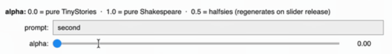
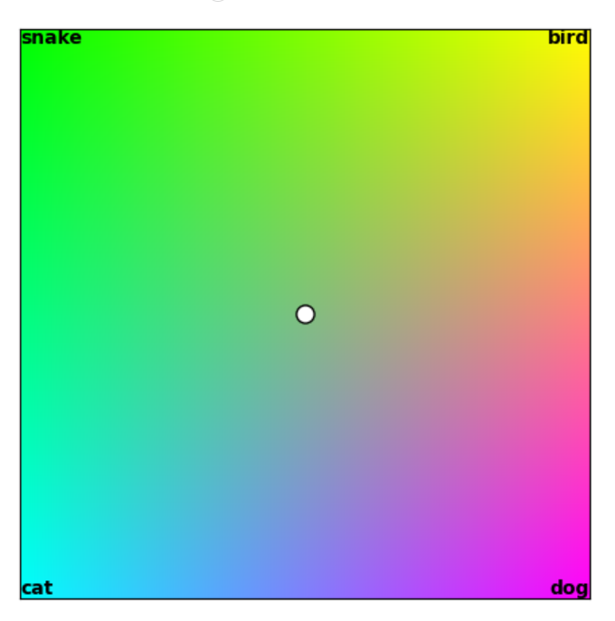
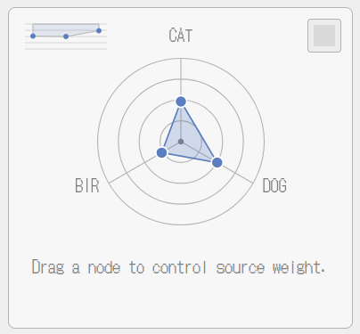
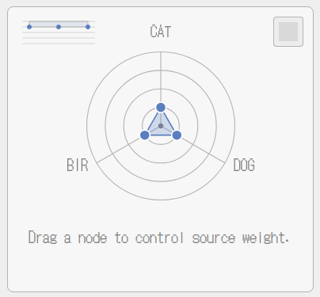
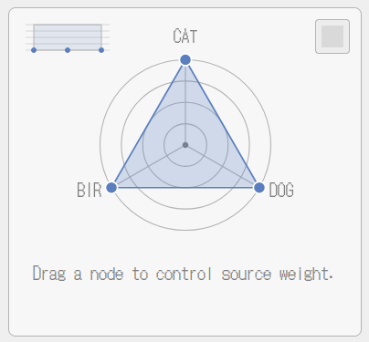

# 🕸 ABC-GPT Spider-Graph

Dovetailing off of Andrew Trask's [abc-gpt](https://github.com/iamtrask/abcGPT), this interface explores how to give tangible and steerable controls to those less technical so that they may begin to form the base of AI literacy.

More specifically it takes Trask's 2-scale example for neuron specific training and introduces a system that expands it to up to 7 sources (3 for POC, 7 for end goal) with blendable in-between states.  It's main focus is in making the concept of per source "alpha" tangible to the user. 


## What this is

A small GPT (attention + LayerNorm, two layers, trained from scratch in NumPy) whose neurons are each assigned to one of three sources; a Cat, Dog, and Bird word corpora. A per-source dial, `alpha`, controls how loudly each source gets to speak in the generated text. Drag one dial up and its words come through. Lower all three down together and the model leans more on its raw, untrained input and less on what it actually learned through training — an `alpha` direction and magnitude.

It mimics the core mechanic behind Andrew Trask's [abcGPT](https://github.com/iamtrask/abcGPT) and the [Attribution-Based Control](https://attribution-based-control.ai)
series it belongs to — the two-source slider that morphs a model between Shakespeare and TinyStories. This sketch is an independent exploration of the same idea from the interface side: **how do you make "alpha" something a non-technical person can *feel*, can *embody*?**

## What's here

- `spider-graph-attribution.ipynb` — the model, trained from scratch, with the full design rationale, a from-scratch derivation of attention and LayerNorm, and the depth-vs-presence finding that motivated the second readout above. Executed — outputs are saved, no GPU or rerun required to read it.
- `index.html` / `style.css` / `script.js` — the interactive frontend.
- `app/` — a small local Flask server (`backend.py`) that loads the notebook's trained weights (`weights.npz`) and serves real generated text back to the interface.

## Run it

```bash
cd app
python3 -m venv .venv
.venv/bin/pip install -r requirements.txt
.venv/bin/python backend.py
```

Then open `http://127.0.0.1:5058/` and drag a dial. Everything runs locally, meaning no API keys, no hosted compute, no network calls beyond loading the page's own fonts.

## Status

This is a proof-of-concept checkpoint, not a finished tool — built to test whether the spider-graph interaction actually produces the intuition it's aiming for. `Wqkv`/`Wo`/`Win`/`Wout` are a small, three-source model; the interaction pattern itself is designed to generalize past three.

## Credit

Built on the gating mechanism from Andrew Trask's [abcGPT](https://github.com/iamtrask/abcGPT) (a fork of Karpathy's
[nanoGPT](https://github.com/karpathy/nanoGPT)) and the ideas developed in his [Attribution-Based Control](https://attribution-based-control.ai) series. The model here is an independent from-scratch NumPy reimplementation, not a fork of that codebase. So please go to the original codebase for more detailed information about model training and treatments.

---

# 📝 Design Rationale
## 1.0 The Interface Challenge
The original example of abc-gpt uses two neurons, a Shakespeare neuron on one end and a Tiny Stories (children's stories) neuron at the other end. These points form a spectrum with blended states in-between during output. By nature and by control (a slider) a polar relationship is inferred. If Shakespeare, then less Tiny Stories and vice versa, but what happens when you introduce more than 2 sources say 3 (a triangle) or 4 (a rectangle)? Furthermore, what happens when the sources that form those shapes do not draw clear spectrums between each other; do not have a clear semantic relationship? 



For example, on a line (2 sources) a source of "Dog Words" may sit opposite of a source with "Cat Words" but if you introduce a source of "Bird words" and a source of "Snake words" now making that line a rectangle (4 sources) where would "Snake" and "Bird" sit? Bird may be seen opposite of "Cat" but conceptually humans have not drawn a polar relationship between the idea of "Snake" with any of the other sources.

### 1.1 Current Directions
There are two ways I am exploring this phenomena through interface. 

(1) I am leaning in by using the metaphor of color to help illustrate the polarizing nature of a summed amount of weights (a similar approach to forming color gradient meshes). A user can go to one corner, say Red, another corner say Green, and another corner say Blue, but placing the alpha in the center will always yield an equal amount of all three (White). I believe in cases where users have a mental construct of sources that involve clear relationships, then this approach could be a very effective way to relay model output behavior to a nontechnical AI user. Although interesting in their own right, those experiments will be held in a different interactive tool and notebook as I believe they are less generally applicable.

(2) What is illustrated in this notebook is pathway number two: using the metaphors of shape and sound to demonstrate 3D or layered ideas of model behavior through a 2D interface. In the case of four sources -- let's use animals again of Dog, Cat, Bird, Snake -- if you were to try to visualize the shape of weight the model is taking through interface, a rectangle may seem appropriate. However, if you give the user only one input (ex. a coordinate within that rectangle)  then you end up forcing a relationship between sources encountering a limitation of central blending. For example, if you had a rectangle (A,B,C,D) in the scenario of a single coordinate input, you could never isolate a model output that represents a pure blend of A to D and B to C. Each of those coordinates would lie at the center of a flat rectanglular shape and actually be an equal blend of all A + B + C + D. Using the example below, this means that you could never isolate a distinct "Snake" + "Dog" blend from a "Snake" + "Bird" + "Cat" + "Dog" blend. 



## 2.0 Why a Spider-Graph?
So how do you indicate independent layers or relationships amongst coordinates on a 2D plane? In this case I am using the convention of a spider-graph with the ability to have an alpha input per source (handles for each source axis). This is the evolution of having an alpha slider per source. 

A slider for alpha per source allows independent control instead of interdependent relational control. You can have a "Dog" voice at full volume and a "Cat" voice at full volume simultaneously solving the all or nothing blend issue. Representing it as handles on a spider-graph translates the mechanic in a way where users can still form a mental construct of how the model weighs source influence.



### 2.1 Limitations of Spider-Graph
Although the spider-graph allows for a moldable interface for alpha's independent direction, it does not convey what the difference between a shallow sampling of the sources looks like versus a deep sampling of the sources. For example, if you have a vector of Cat 0.25, Dog 0.25, Bird 0.25 and later pull them out to be an equilateral shape of Cat 1.0, Dog 1.0, Bird 1.0, a spider-graph indicates there is a difference but does not indicate well how the difference relates to the model.





Users may assume that the difference is that at 0.25 the output is less noisy and at 1.0 the output is more noisy. In reality `LayerNorm` makes it to where at 0.25 the sampling is shallow and at 1.0 the sampling is more comprehensive (deeper). To help offset this limitation I have put a key map in the top-right of the interface that shows alpha magnitude -- dots linked to each source that go down the y-axis as their alpha value increases in real time; a direct mirror of the spider-graph handles. What this keymap does is it acts as a quick visual aid that helps the user compare and internalize the idea of model depth when sampling. What the keymapo does not do is represent all neurons (ex. halfsie neurons are excluded) nor does it depict any meaningful relationship amongst sources on the x-axis. It is a scanning tool for depth nothing more.

## 3.0 Other Design Decisions & Future Work
### 3.1 Limiting to 7 Sources
At the end of the day this is an applied version of Trask's abc-gpt meant to illustrate how source attributed AI can help users mold their AI experiences through blended voice control. It is an intimate experience as opposed to a mass networked one. Drawing from that foundation, this interface is not aimed at making an entire AI network tangible to the user. It is instead aimed at being a frame that supports building embodied AI literacy through prompting users to mold their own AI chat entities. With that in mind, design decisions were made to decrease cognitive overload, the source count being a primary example. Keeping to Miller's law the source max is at 7, this is to ensure both that visual(concrete) to abstract intake remains steerable. 

## 3.2 Future Work
Even under this umbrella, the 7 sources act as 7 buckets, the design of the interface does not cap data size or pointing to folders or "clusters" of data, nor is it meant to. The true limitation to what can be represented by each source and how that translates in latency between the input and output is dependent on hardware and optimization between the backend and frontend. Hardware accessibility and capabilities are outside the scope of this work. Model optimization in regards to source attributed AI is the current work at OpenMined that links into this project. Optimization of how the backend and frontend connect and what that means in terms of interface latency is future work for this project.

### 3.3 Use Case Ideas
I can see this convention being used in both professional and personal settings. 
- In a healthcare setting you could have a use case where the sources represent specialties (e.g. cardiology versus family practice) the weights would then indicate exploring how treatment approaches differ per specialty given a set of symptoms. 
- In a more proactive sense you could have use cases where you actively investigate collective reasoning and consensus. For example, as a business it may be difficult to understand how each department interprets the company vision and or its values. You could survey the employees, group the responses by department, and have each department be a source. From there you could tangibly explore how the departments differ in perspective. 
- In a similar vein you could take the same approach to a personal use case, let's say a D&D campaign. You could have all players generate materials say a game scenario. The source nodes would represent different player submissions for a scenario. You could then manipulate the spider graph to generate a scenario entirely new made from the blending of each player's scenario submission.

### 3.4 POC to Tool
Some items still on the todo list for this sketch are as follows:
- Introduce temperature and top_k
- Introduce length and a prompt input
- Expand to 7 sources over 3
- Test and define limitations of local Flask instance and when a more robust deployment need be taken
- Stylize
- Templatize
